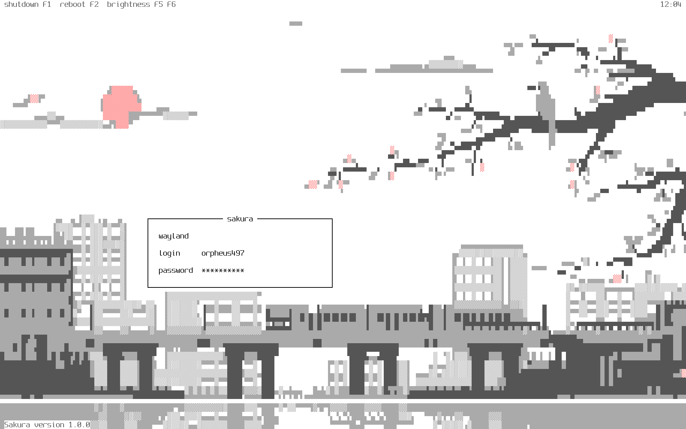

# The Sakura display manager



_Note: Sakura ships with an animated wallpaper, drawn on the console with
half-block characters. See [The wallpaper](#the-wallpaper) below._

Sakura is a lightweight TUI (ncurses-like) display manager built exclusively
for FreeBSD. It runs on a virtual terminal, talks to OpenPAM directly, and does
not depend on a graphical toolkit, a session bus, or a login-manager framework.

Sakura only targets FreeBSD. The build refuses any other target on purpose: all
the console, power-management and account handling goes through FreeBSD
interfaces (`vt(4)`, `kbio(4)`, `consio(4)`, `reboot(2)`, `setusercontext(3)`
and `sysctl(3)`) rather than through a portability layer.

Sakura is also the login layer of the **Sakura desktop**, a three-part Wayland
desktop environment built specifically for FreeBSD alongside
[hikari-sakura](https://github.com/orpheus497/hikari-sakura), the compositor,
and [Sofi](https://github.com/orpheus497/sofi), its shell. Sakura is the piece
that comes first — it is where the desktop takes its name from, and it is what
authenticates you and hands the machine over to the other two. See
[The Sakura desktop](#the-sakura-desktop) below.

It stands on its own, though. Nothing here depends on the other two projects:
Sakura launches any X11, Wayland or shell session that any other login manager
would, and the desktop is an option rather than a requirement.

## The Sakura desktop

Three projects make up a complete Wayland desktop for FreeBSD. Each is a
separate repository, separately buildable and separately useful, and each
covers one layer that the other two deliberately do not:

| Component | Layer | What it is | License |
| --- | --- | --- | --- |
| **Sakura** (this repository) | Login | A TUI display manager on the `vt(4)` console. Authenticates through OpenPAM and launches the session. | BSD 2-Clause |
| **[hikari-sakura](https://github.com/orpheus497/hikari-sakura)** | Compositor | A stacking Wayland compositor with tiling, built on wlroots. Organises windows into *views*, *groups*, *sheets* and a *workspace*. | BSD 2-Clause |
| **[Sofi](https://github.com/orpheus497/sofi)** | Shell | The layer-shell surfaces — application menu, task strip, sheet switcher, notification daemon and system tray — in one binary. | MIT |

The split is along process and privilege boundaries rather than taste. Sakura
runs before there is a graphical session at all and is the only one of the three
that touches PAM. hikari-sakura owns the Wayland session. Sofi is an ordinary
unprivileged client that draws through `zwlr_layer_shell_v1`, so a bug in the
shell cannot take the compositor down with it.

### Where the names come from

Sakura, this display manager, was named first. The other two names are built
outward from it, and the shape of each name records what it is attached to:

- **hikari-sakura** takes *hikari* from the compositor it forks —
  [`antaz/hikari`](https://github.com/antaz/hikari), originally by `raichoo`,
  abandoned upstream — and *sakura* from this display manager. The second half
  of the name is what marks it as part of this desktop rather than a
  continuation of the original.

- **Sofi** is a hard fork of [rofi](https://github.com/davatorium/rofi), and
  swaps rofi's leading **r** for the **S** of Sakura. The rest of the name is
  inherited; the letter that changed is the one that says whose desktop it
  belongs to.

So the naming is a lineage, not a namespace: each project keeps the name of what
it came from and carries Sakura's mark for what it became part of.

### How the three fit together at runtime

The hand-off runs in one direction, and each stage exits or backgrounds itself
once the next has taken over:

1. `init(8)` starts `getty(8)` on a virtual terminal, which hands it to
   **Sakura** through the `sakura_wrapper` program named in `/etc/gettytab`.
2. Sakura draws the login box on the `vt(4)` console, authenticates you through
   OpenPAM, and sets up the session environment with `setup.sh`.
3. You pick the **Hikari Sakura** session — Sakura finds it automatically,
   because hikari-sakura installs `hikari.desktop` into
   `/usr/local/share/wayland-sessions`, which is Sakura's default
   `waylandsessions` path.
4. That entry runs `start-hikari`, which prepares `XDG_RUNTIME_DIR`, clears any
   leaked `WAYLAND_DISPLAY`/`DISPLAY`, wraps the session in D-Bus if needed, and
   execs the compositor.
5. hikari-sakura runs `~/.config/hikari/autostart` on startup, which is where
   **Sofi**'s two long-running services belong.
6. Logging out returns you to Sakura, which redraws the login box on the same
   virtual terminal.

Setting the desktop up from Sakura's side is covered in
[Running hikari-sakura](#running-hikari-sakura) under Sessions.

## Dependencies

Sakura itself needs very little. Shutdown, reboot, virtual terminal switching
and the keyboard LEDs are all handled in-process through FreeBSD system calls,
so none of them pulls in a helper binary. Most of the list below exists for
sessions you might launch, not for Sakura.

**Build:**

| Package | Why |
| --- | --- |
| `zig` | 0.16.x, and it must be a **release** build — check that `zig version` has no `-dev` suffix |
| `libxcb` | Only with X11 support, which is on by default. Turn it off with `-Denable_x11_support=false` |
| `pkgconf` | Only with X11 support. Zig resolves `xcb` through pkg-config, and `xcb.pc` lives in `/usr/local/libdata/pkgconfig` |
| `ca_root_nss` | So Zig can fetch its dependencies over HTTPS |
| `git` | **Optional.** Used only to derive the version string. Without it, Sakura reports the version compiled into `build.zig` |

libc and OpenPAM come from the base system, so there is nothing to install for
either.

**Runtime:** nothing, for Sakura itself. The base system's `backlight(8)`
backs the brightness keybinds, and that is already present.

**For the sessions you run:**

| Package | Why |
| --- | --- |
| `xorg` | Only to run X11 sessions |
| `xauth` | Only to run X11 sessions |

**Optional tools:**

| Package | Why |
| --- | --- |
| `python3`, `otf2bdf` | Only to build a console font from your own typeface with `tools/mkvtfont.py`. `vtfontcvt` is already in base. You do **not** need this for the wallpaper — see [Console font](#console-font) |

So a build with X11 support needs:

```sh
# pkg install zig pkgconf libxcb ca_root_nss
```

and, if you intend to run X11 sessions:

```sh
# pkg install xorg xauth
```

## Building

```
$ git clone https://github.com/orpheus497/sakura.git sakura
$ cd sakura
$ zig build
```

After building, you can (optionally) test Sakura in a terminal emulator,
although authentication will **not** work:

```
$ zig build run
```

> [!IMPORTANT]
> While you can run Sakura in a terminal emulator as root, it is **not**
> recommended. To properly test Sakura, install it, wire it up in `/etc/ttys`
> as described below, and reboot.

> [!NOTE]
> You can, however, test configuration file changes that way. Note that you
> must press Ctrl+C in order to exit Sakura.

## Installing

```
# zig build installexe
```

This installs:

| Path | Contents |
| --- | --- |
| `/usr/local/bin/sakura` | the display manager |
| `/usr/local/bin/sakura_wrapper` | the `getty(8)` wrapper (see below) |
| `/usr/local/etc/sakura/config.ini` | the configuration, with `config.ini.example` kept pristine beside it |
| `/usr/local/etc/sakura/pixel_sakura.gif` | the default wallpaper |
| `/usr/local/etc/sakura/startup.sh` | runs before the terminal is taken over (`start_cmd`) |
| `/usr/local/etc/sakura/setup.sh` | shell environment setup after login (`setup_cmd`) |
| `/usr/local/etc/sakura/gettytab.example` | the `/etc/gettytab` block, filled in (see below) |
| `/usr/local/etc/sakura/ttys.example` | the `/etc/ttys` line, filled in (see below) |
| `/usr/local/etc/sakura/example.dur` | the default `dur_file` animation |
| `/usr/local/etc/sakura/example.lua` | the example `lua` animation |
| `/usr/local/etc/sakura/lang/` | the 25 language files |
| `/usr/local/etc/sakura/custom-sessions/` | your own session entries, plus a `README` on the supported keys |
| `/usr/local/etc/pam.d/sakura` | the PAM policy used for normal logins |
| `/usr/local/etc/pam.d/sakura-autologin` | the PAM policy used for autologin |

The defaults follow the FreeBSD ports layout (`--prefix` is `/usr/local` and
the configuration lives under `/usr/local/etc`). Both can be overridden:

```
# zig build installexe -Dprefix_directory=/usr/local -Dconfig_directory=/usr/local/etc
```

### Build options

All of these are passed to `zig build` as `-D<name>=<value>`. The ones marked
*embedded* are compiled into the binary, so changing them means rebuilding, not
just editing `config.ini`.

| Option | Default | What it does |
| --- | --- | --- |
| `dest_directory` | *(empty)* | Staging root. Every installed path is written beneath it instead of `/`. This is the `DESTDIR` equivalent a package build uses; it does not affect paths compiled into the binary |
| `prefix_directory` | `/usr/local` | Install prefix. *Embedded* — it is also the default for `x_cmd`, `xauth_cmd`, `xsessions` and `waylandsessions` |
| `config_directory` | `/usr/local/etc` | Configuration root. *Embedded* — it is also the default for `custom_sessions`, `save_file_dir`, `setup_cmd`, `gif_file`, `dur_file_path` and `lua_animation_file` |
| `name` | `sakura` | Renames **only** the installed binary and its getty wrapper. The configuration directory, both PAM policies and the default `service_name` stay `sakura` |
| `enable_x11_support` | `true` | Links `libxcb` for X11 sessions. Set `false` for a Wayland- or console-only build, which then needs neither `libxcb` nor `pkgconf` |
| `default_tty` | `2` | The virtual terminal Sakura is installed onto. Fills in the generated `gettytab.example` and `ttys.example`. Must be 1 or greater |
| `fallback_tty` | `2` | *Embedded.* The terminal to fall back to if the current one cannot be determined |
| `uid_min` | `1000` | *Embedded.* Lowest UID shown in the user list |
| `uid_max` | `32000` | *Embedded.* Highest UID shown in the user list |

For example, a Wayland-only install staged into a package root:

```sh
# zig build installexe -Denable_x11_support=false -Ddest_directory=/tmp/stage
```

### Installing as a package

A FreeBSD port skeleton lives in [`ports/`](ports/). It builds the same way,
takes X11 as an on/off option, stages through `-Ddest_directory`, and ships the
`/etc/gettytab` and `/etc/ttys` steps as a `pkg-message` so a package install
still tells you about them. Copy it into a ports tree (as `x11/sakura`), run
`make makesum` to generate `distinfo`, and build it normally.

If another display manager is currently enabled, disable it first. For example,
for LightDM:

```
# service lightdm stop
# sysrc lightdm_enable="NO"
```

## Enabling

FreeBSD starts a `getty(8)` on each virtual terminal listed in `/etc/ttys`.
Sakura replaces the login program on one of them. Both snippets below are
installed to `/usr/local/etc/sakura/` as `gettytab.example` and `ttys.example`,
already filled in with the paths you built with.

First, append the Sakura entry to `/etc/gettytab` (see `gettytab(5)`):

```
sakura:\
	:lo=/usr/local/bin/sakura_wrapper:\
	:al=root:
```

`lo` replaces `login(1)` with Sakura's wrapper, and `al` makes `getty` hand the
terminal over without prompting for a user name first.

> [!NOTE]
> The wrapper exists because `getty` appends `login -fp root` to the program
> named by `lo`, which Sakura does not accept. The wrapper drops those
> arguments and then executes Sakura.

Then point a virtual terminal at that entry in `/etc/ttys` (see `ttys(5)`).
FreeBSD numbers virtual terminals from 1 but names their device nodes from 0,
so virtual terminal 2 — Sakura's default — is `/dev/ttyv1`:

```
ttyv1	"/usr/libexec/getty sakura"	xterm	onifexists	secure
```

Finally, make `init(8)` re-read the file:

```
# kill -HUP 1
```

To run Sakura on a different virtual terminal, build with `-Ddefault_tty=N`
(which also adjusts the generated examples) and edit the matching `/etc/ttys`
line instead.

## Updating

You can install Sakura without overriding the current configuration file:

```
# zig build installnoconf
```

## Uninstalling

```
# zig build uninstallexe
```

`uninstallnoconf` does the same but keeps `/usr/local/etc/sakura`. Neither
touches `/etc/gettytab` or `/etc/ttys`, so remember to revert those by hand.

## Configuration

All configuration lives in `/usr/local/etc/sakura/config.ini`. The file is fully
commented and shows the value of every option, which is the built-in default
except where a comment says otherwise. A pristine copy is kept next to it as
`config.ini.example`.

You can check the validity of your configuration file (i.e. whether there are
any errors in it) with:

```
$ sakura --validate-config /usr/local/etc/sakura/config.ini
```

Logs are defined by that same file:

- The session log is at `~/.local/state/sakura-session.log` by default.

- The system log is at `/var/log/sakura.log` by default. If set to `null`,
  `syslog(3)` is used instead, under the `sakura` identifier.

### Command-line options

| Option | Argument | What it does |
| --- | --- | --- |
| `-h`, `--help` | — | List the options and exit |
| `-v`, `--version` | — | Print the version and exit |
| `-c`, `--config` | a **directory** | Read the configuration from there instead of `/usr/local/etc/sakura`. Sakura looks inside it for `config.ini`, `lang/` and the save file |
| `--validate-config` | a **file** | Check a configuration file for errors and exit |

The two path options differ deliberately: `--config` points at a directory
because Sakura needs the language files and the save file alongside the
configuration, while `--validate-config` checks one named file.

### Choosing a language

Twenty-five translations are installed to `/usr/local/etc/sakura/lang/`. Pick
one by its file name without the extension:

```ini
lang = de
```

Available: `ar`, `bg`, `cat`, `cs`, `de`, `en`, `eo`, `es`, `fr`, `it`,
`ja_JP`, `ku`, `lv`, `pl`, `pt`, `pt_BR`, `ro`, `ru`, `sr`, `sr_Cyrl`, `sv`,
`tr`, `uk`, `zh_CN`, `zh_TW`.

Editing one of those files changes any string in the interface. The keys are
also what `$name` substitution in custom binds refers to.

### Autologin

Sakura can log a user straight in without a password prompt. It installs a
dedicated PAM policy for this at `/usr/local/etc/pam.d/sakura-autologin`, which
uses `pam_permit`.

```ini
auto_login_user = alice
auto_login_session = hikari
```

| Option | Default | What it does |
| --- | --- | --- |
| `auto_login_user` | `null` | The account to log in. `null` disables autologin |
| `auto_login_session` | `null` | Which session to start. `null` disables autologin |
| `auto_login_service` | `sakura-autologin` | The PAM policy to authenticate against |

Both `auto_login_user` and `auto_login_session` must be set; leaving either
`null` disables the feature. For the session name, use a `.desktop` file's name
without the extension, its `Name` field, or its `DesktopNames` value — the
files are in `/usr/local/share/xsessions/` and
`/usr/local/share/wayland-sessions/`.

> [!WARNING]
> Autologin means anyone with physical access has that user's session without
> authenticating. The default PAM policy permits the login unconditionally.

### Appearance

Colours are `0xSSRRGGBB`, where `SS` is a style byte. The vt(4) console has
sixteen colours, so values are mapped onto the nearest one rather than shown
literally — `config.ini` explains the mapping in place.

| Option | Default | What it does |
| --- | --- | --- |
| `bg` | `0x00FFFFFF` | Background colour |
| `fg` | `0x20000000` | Foreground (text) colour |
| `border_fg` | `0x20000000` | Colour of the login box border |
| `error_bg` | `0x00FFFFFF` | Background of the error line |
| `error_fg` | `0x01FF0000` | Foreground of the error line |
| `box_title` | `sakura` | Text in the box's top border. `null` for none |
| `box_position_h` | `0.30` | Horizontal position, 0.0–1.0, measured from the **left** |
| `box_position_v` | `0.62` | Vertical position, 0.0–1.0, measured from the **top** |
| `margin_box_h` | `2` | Horizontal padding inside the box |
| `margin_box_v` | `1` | Vertical padding inside the box |
| `blank_box` | `true` | Clear the wallpaper behind the box so text stays readable |
| `hide_borders` | `false` | Draw no border at all |
| `edge_margin` | `0` | Cells kept clear at the screen edge |
| `text_in_center` | `false` | Centre the field labels rather than left-aligning them |
| `input_len` | `34` | Visible width of the input fields |
| `asterisk` | `*` | Character masking the password. `null` shows nothing at all |
| `full_color` | `true` | Use all sixteen console colours rather than the eight-colour subset |

`box_position_h` and `box_position_v` are measured from the top-left, so larger
values move the box right and down. The shipped default sits the box clear of
the wallpaper's branch.

### Corner widgets

The four screen corners each hold a list of small readouts. This is the largest
customisation surface Sakura has, and the defaults only use a fraction of it.

```ini
corner_top_left = shutdown,restart,britup,britdown,password battery
corner_top_right = clock numlock,capslock
corner_bottom_left = version
corner_bottom_right = labels
```

The syntax is two levels: **commas** place entries side by side on one line, and
**spaces** start a new line. So the default top-left corner is two lines — the
four key hints and the password hint sharing the first, and the battery on the
second.

| Name | Shows |
| --- | --- |
| `shutdown` | The shutdown key hint |
| `restart` | The restart key hint |
| `britup` | The brightness-up key hint |
| `britdown` | The brightness-down key hint |
| `password` | The show-password key hint |
| `clock` (or `time`) | The current time, formatted by `clock` |
| `tty` | Which virtual terminal Sakura is on |
| `battery` | Charge level, if `battery_sysctl` is set |
| `version` | Sakura's version |
| `numlock` | Num Lock state |
| `capslock` | Caps Lock state |
| `labels` | Your own `[lbl:...]` labels — see below |

`custom_bind_width` sets the column width used to lay these out; `null` sizes
them automatically.

### Custom commands and labels

Two extra section types let you bind your own commands and put your own text on
the login screen. Both go at the end of `config.ini`.

A **command** binds a shell command to a key:

```ini
[cmd:F8]
cmd = touch /tmp/sakura.gaming
name = gaming mode
```

The `name` is what appears in the corner hints. Writing `$key` in it substitutes
a string from the current language file — for instance `$brightness_up` gives
whatever that locale calls brightness up. Any key in a `lang/*.ini` file works.

A **label** runs a command and displays its output:

```ini
[lbl:kernel]
cmd = uname -srn
refresh = 0
```

The identifier after `lbl:` must be unique. `refresh` is how many frames to
wait before re-running the command; `0` runs it once and leaves the result. To
see labels at all, one of the corners must list `labels`.

### Clock and status

| Option | Default | What it does |
| --- | --- | --- |
| `clock` | `null` | `strftime(3)` format for the corner clock, e.g. `%H:%M`. `null` hides it |
| `bigclock` | `none` | A large clock drawn above the box: `none`, `en` or `fa` |
| `bigclock_12hr` | `false` | Twelve-hour big clock |
| `bigclock_seconds` | `false` | Show seconds on the big clock |
| `battery_sysctl` | `null` | The sysctl MIB holding battery charge, e.g. `hw.acpi.battery.life`. `null` hides the battery readout |
| `numlock` | `false` | Turn Num Lock on at startup |

### Sessions and behaviour

| Option | Default | What it does |
| --- | --- | --- |
| `xsessions` | `/usr/local/share/xsessions` | Where to look for X11 `.desktop` files. Colon-separated for several |
| `waylandsessions` | `/usr/local/share/wayland-sessions` | Same, for Wayland |
| `custom_sessions` | `/usr/local/etc/sakura/custom-sessions` | Session entries visible only to Sakura |
| `shell` | `true` | Offer a plain shell session |
| `xinitrc` | `~/.xinitrc` | Offer an xinitrc session. `null` hides it |
| `default_input` | `login` | Which field is focused at startup: `info_line`, `session`, `login` or `password` |
| `type_username` | `false` | Type the username freely instead of choosing from a list |
| `allow_empty_password` | `true` | Permit accounts with no password |
| `auth_fails` | `10` | Failed attempts before Sakura pauses |
| `clear_password` | `false` | Clear the password field after a failed attempt |
| `service_name` | `sakura` | PAM policy used for normal logins |
| `path` | *(see `config.ini`)* | `PATH` set for the session. `null` leaves it alone |
| `save_file_dir` | `/usr/local/etc/sakura` | Where the last-used user and session are remembered |
| `session_log` | `.local/state/sakura-session.log` | Session output log, relative to the user's home |
| `sakura_log` | `/var/log/sakura.log` | Sakura's own log. `null` uses `syslog(3)` under the `sakura` identifier |
| `initial_info_text` | `null` | Text shown on the info line at startup |
| `start_cmd` | `null` | Runs before the terminal is taken over. The shipped file sets this to `startup.sh` |
| `setup_cmd` | `/usr/local/etc/sakura/setup.sh` | Sets up the shell environment after login |
| `login_cmd` | `null` | Runs on every successful login |
| `logout_cmd` | `null` | Runs on every logout |
| `inactivity_cmd` | `null` | Runs after `inactivity_delay` seconds with no input |
| `inactivity_delay` | `0` | Seconds of inactivity before `inactivity_cmd`. `0` disables it |
| `x_cmd` | `/usr/local/bin/X` | The X server binary |
| `xauth_cmd` | `/usr/local/bin/xauth` | The xauth binary |
| `x_vt` | `null` | Virtual terminal handed to the X server. `null` uses the current one. Does not apply to Wayland |

### Writing your own animations and sessions

Three files installed alongside the configuration are complete references, not
just samples:

- `/usr/local/etc/sakura/example.lua` — its header documents the whole Lua
  animation API: the `sakura` table, `putCell`, `putRect`, `putLabel` and
  `clock`, the `draw()` function you must define, and which standard libraries
  are available. Point `lua_animation_file` at your own script.
- `/usr/local/etc/sakura/example.dur` — the default `dur_file` animation.
- `/usr/local/etc/sakura/custom-sessions/README` — every desktop-entry key
  Sakura understands, for hand-written session entries.

### Migrating from Ly

An existing Ly configuration can be used as-is: Sakura migrates it on load, and
the same applies to a Ly save file. Nothing needs converting by hand, but it is
worth knowing what changes, because the migration is silent.

Renamed, with the old name still accepted:

| Ly | Sakura |
| --- | --- |
| `ly_log` | `sakura_log` |
| `min_refresh_delta` | `animation_frame_delay` |
| `blank_password` | `clear_password` |

Dropped, because they have no FreeBSD equivalent:

- `battery_id` — the Linux sysfs identifier. Use `battery_sysctl`, which takes a
  sysctl MIB such as `hw.acpi.battery.life`, instead.
- `login_defs_path` — `/etc/login.defs` is a Linux file. The UID range is fixed at
  build time with `-Duid_min` and `-Duid_max`.

Folded into other options: `sleep_key`/`sleep_cmd` and
`hibernate_key`/`hibernate_cmd` become custom keybinds, since FreeBSD has no
equivalent of the helpers Ly called. `animate` is folded into `animation`, and
`save`/`save_file` into `save_file_dir`.

Options that changed type — `animation`, `bigclock` and `default_input` moved
from integers to names, and the colour options from 16-bit codes to the
`0xSSRRGGBB` form — are converted for you. A configuration whose colours are all
old-style eight-colour codes is taken to predate true-colour support, so
`full_color` is turned off and the remaining colours are set to their
eight-colour equivalents rather than to Sakura's defaults.

Several Ly options no longer exist at all and are ignored if present:
`wayland_specifier`, `wayland_cmd`, `x_cmd_setup`, `mcookie_cmd`,
`term_reset_cmd`, `term_restore_cursor_cmd`, `console_dev`, `shutdown_cmd`,
`restart_cmd`, `load`, `max_desktop_len`, `max_login_len`, `max_password_len`,
`hide_key_hints`, `hide_keyboard_locks`, `hide_version_string` and `show_tty`.
Shutdown and restart are no longer commands because Sakura calls `reboot(2)`
directly.

## The wallpaper

Sakura draws an animated GIF behind the login box. The console has no
framebuffer, so every cell is painted as a block glyph carrying two colours.
Each cell is matched against the source at 2x2 resolution and the closer of two
families wins: the sixteen quadrant patterns, which place two flat colours
spatially, or the shades `U+2591/2/3`, which dither two colours to fake a tone
the console does not have.

That second family is what keeps any colour at all. A vt(4) console stores a
colour in three bits plus a brightness bit -- sixteen colours, no more -- so a
pastel has no flat equivalent and can only be approximated by mixing. Mixing
shows as visible stipple, so it is penalised in proportion to how far apart the
two colours are, and that penalty is relaxed where the source is strongly
coloured. A grey sky stays flat; a pink sun keeps its hue. `gif_stipple` sets
how hard the penalty bites.

Frames are decoded as the animation plays rather than up front, so startup
isn't delayed, and each frame is cached after its first pass.

The relevant options in `config.ini`:

| Option | Meaning |
| --- | --- |
| `animation` | `gif` by default; set to `none` to turn the wallpaper off |
| `gif_file` | which GIF to show |
| `gif_scaling` | `fill` (default), `fit`, `stretch` or `none` |
| `gif_font_aspect` | cell height divided by cell width; see below |
| `gif_stipple` | how readily two colours are dithered together (default `0.2`) |

To use your own wallpaper, drop any GIF87a/GIF89a file — animated or still — in
place of `/usr/local/etc/sakura/pixel_sakura.gif`, or point `gif_file` somewhere
else. Nothing needs rebuilding; log out and back in.

### Other backgrounds

`animation` selects what is drawn behind the login box. `gif` is the default and
everything above describes it, but the animations Sakura inherited from Ly are
all still available, each with its own `config.ini` options:

| `animation` | What it draws |
| --- | --- |
| `gif` | the animated wallpaper described above (default) |
| `none` | nothing; the plain background colour |
| `doom` | the PSX DOOM fire effect (`doom_*`) |
| `matrix` | falling CMatrix glyphs (`cmatrix_*`) |
| `colormix` | a slow three-colour shader (`colormix_*`) |
| `gameoflife` | Conway's Game of Life (`gameoflife_*`) |
| `dur_file` | a [durdraw](https://github.com/cmang/durdraw) animation (`dur_file_path`, `dur_*`) |
| `lua` | your own animation written in LuaJIT (`lua_animation_file`) |

`dur_file` defaults to the sakura blossom in
`/usr/local/etc/sakura/example.dur`, and `lua` to the bouncing squares in
`example.lua`, which is commented as a starting point for writing your own. Note
that a `.dur` file saved with a 256-colour range will not draw while
`full_color` is off.

Two options apply to whichever animation you choose:

| Option | Default | What it does |
| --- | --- | --- |
| `animation_frame_delay` | `5` | Delay between frames, in milliseconds. Higher is slower and cheaper |
| `animation_timeout_sec` | `0` | Stop animating after this many seconds and leave the last frame on screen. `0` never stops |

> [!IMPORTANT]
> `gif_font_aspect` must match your console font or the image will look
> stretched. Set it to the cell's height divided by its width: `2.0` for an
> 8x16 or 12x24 font (the default), `17 / 7 = 2.43` for a 7x17 one.

The wallpaper's detail is set by how many cells the console has, so the console
font matters more than anything else here. On a 1920x1200 panel a 16x32 font
gives 120x37 cells, 12x24 gives 160x50, and 8x16 gives 240x75 — each step
roughly doubling the resolution at the cost of smaller text. The shipped
defaults are tuned for 12x24:

```
# sysrc allscreens_flags="-f /usr/share/vt/fonts/spleen-12x24.fnt"
```

## Console font

**You do not need to build a font.** The FreeBSD console fonts below each
contain all eighteen glyphs the wallpaper draws with, so the wallpaper renders
correctly on a stock install with any of them:

| Font | Cell | Wallpaper glyphs |
| --- | --- | --- |
| `spleen-8x16` | 8x16 | all 18 |
| `spleen-12x24` | 12x24 | all 18 |
| `spleen-16x32` | 16x32 | all 18 |
| `gallant` | 12x22 | all 18 |
| `terminus-b32` | 16x32 | all 18 |

Picking one of those is the whole of the setup, and the only reason to choose
between them is the resolution trade-off described above:

```sh
# sysrc allscreens_flags="-f /usr/share/vt/fonts/spleen-12x24.fnt"
```

The rest of this section is for using **your own** typeface on the console
instead, which is optional.

vt(4) only loads bitmap fonts, so a scalable font has to be rasterised first.
`tools/mkvtfont.py` does that, and also fixes up the two things that would
otherwise spoil the wallpaper: `vtfontcvt` rejects the zero-sized glyphs
`otf2bdf` emits for blanks, and block elements rasterised from outlines rarely
tile the character cell exactly, which bands the image. The block elements are
synthesised at the exact cell size instead.

It needs `python3` and `otf2bdf`; `vtfontcvt` is in the base system.

```
$ python3 tools/mkvtfont.py -p 11 -o sakura-console.fnt \
    /usr/local/share/fonts/nerd-fonts/Hurmit/HurmitNerdFontMono-Regular.otf
# cp sakura-console.fnt /usr/share/vt/fonts/
```

Load it for the current session, or for every terminal at boot:

```
# vidcontrol -f /usr/share/vt/fonts/sakura-console.fnt < /dev/ttyv1
# sysrc allscreens_flags="-f /usr/share/vt/fonts/sakura-console.fnt"
```

Whatever font you choose must contain the box drawing characters
(U+2500-U+2518) that the interface is drawn with, and every glyph the wallpaper
is composed from, or the interface and the wallpaper will show gaps. The
wallpaper needs the halves and the full block (U+2580, U+2584, U+2588, U+258C,
U+2590), the quadrants (U+2596-U+259F) and the three shades (U+2591-U+2593).

No font is bundled: rasterising someone else's typeface and shipping the result
is a licensing question best left to whoever installs it.

## Controls

Use the Up/Down arrow keys to change the current field, and the Left/Right
arrow keys to scroll through the different values (whether it be the info line,
the desktop environment, or the username). The info line is where messages and
errors are displayed.

| Key | Action | Option |
| --- | --- | --- |
| Up / Down | Move between the session, username and password fields | — |
| Left / Right | Scroll through values in the current field | — |
| Enter | Log in | — |
| F1 | Shut down | `shutdown_key` |
| F2 | Restart | `restart_key` |
| F5 | Brightness down | `brightness_down_key`, runs `brightness_down_cmd` |
| F6 | Brightness up | `brightness_up_key`, runs `brightness_up_cmd` |
| F7 | Toggle the password mask on and off | `show_password_key` |
| Ctrl+C | Quit (only useful when testing in a terminal) | — |

Any of those key options may be set to `null` to unbind it, or to another key
name to move it. You can add your own with `[cmd:KEY]` sections — see
[Custom commands and labels](#custom-commands-and-labels).

### vi mode

Setting `vi_mode = true` adds a modal layer over the above, for people who
would rather not leave the home row. It starts in the mode named by
`vi_default_mode` (`normal` or `insert`).

| Key | Action |
| --- | --- |
| `I` | Enter insert mode — type into the current field |
| `Esc` | Return to normal mode |
| `J` | Move down a field (same as Down) |
| `K` | Move up a field (same as Up) |
| `H` | Scroll left through the current field's values (same as Left) |
| `L` | Scroll right through the current field's values (same as Right) |

In normal mode the letter keys move rather than type, so if the username field
seems to ignore your typing, you are in normal mode: press `I` first.

## Sessions

Every environment that works with other login managers should work with Sakura.

- Unlike most login managers, Sakura has an xinitrc and a shell entry.

- Sakura does not refresh itself, so a newly installed environment only shows
  up after Sakura restarts (log out, or reboot).

- If your environment is still missing, check `/usr/local/share/xsessions` or
  `/usr/local/share/wayland-sessions` for a `.desktop` file.

- If there is no `.desktop` file, create one in
  `/usr/local/etc/sakura/custom-sessions` that launches your environment. Those
  entries are only visible to Sakura; put them in the directories above instead
  if you want them system-wide. See the `README` in that directory for the
  supported keys.

### Running hikari-sakura

[hikari-sakura](https://github.com/orpheus497/hikari-sakura) is the compositor
half of the Sakura desktop. Nothing needs configuring on Sakura's side to run
it: `make install` puts `hikari.desktop` in `/usr/local/share/wayland-sessions`,
which is already Sakura's default `waylandsessions` directory, so the session
appears in the list as **Hikari Sakura** the next time Sakura starts. As with
any newly installed environment, Sakura does not rescan while it is running —
log out or reboot.

The entry runs `start-hikari` rather than the `hikari` binary directly. That
wrapper is what makes the session survive being launched from a display manager:
it creates `XDG_RUNTIME_DIR` if the system did not provide one, checks it is
owned by you and mode `0700`, clears any `WAYLAND_DISPLAY` or `DISPLAY` leaked
in from the parent, and wraps the compositor in `dbus-run-session` when no
session bus is already running. Point a session entry at `hikari` yourself and
you lose all of that.

Two FreeBSD-specific things have to be right before any Wayland session will
work, and neither is Sakura's to fix — they are documented in full in
hikari-sakura's readme:

- `kern.evdev.rcpt_mask` must be set (`12`, or `3` if you use `moused`), or
  input devices will not be seen.
- `XDG_RUNTIME_DIR` must not sit on ZFS. Wayland clients that call
  `posix_fallocate` fail there, so on a ZFS-root system `/tmp` needs to be
  backed by `tmpfs`.

**Starting Sofi.** [Sofi](https://github.com/orpheus497/sofi) supplies the
desktop's surfaces, and two of them are long-running services that should come
up with the session rather than be bound to a key. They belong in
hikari-sakura's autostart file, `~/.config/hikari/autostart`, not in Sakura's
`setup.sh` — `setup.sh` runs before the compositor exists, so a layer-shell
client started there has nothing to attach to:

```sh
#!/bin/sh
sofi -notification-daemon &
sofi -tray-daemon &
```

Make it executable. The on-demand surfaces — the application menu, task strip
and sheet switcher — need no autostart at all; hikari-sakura's default
`hikari.conf` already binds them as actions (`sofi -show drun`,
`sofi -show window`, `sofi -show sheets`).

> [!NOTE]
> `x_vt` does not apply here. It exists because Xorg and the console fight over
> a shared virtual terminal; a Wayland compositor takes the terminal over
> cleanly, so hikari-sakura runs on Sakura's own virtual terminal without it.

### A note on X11

Handing Xorg the same virtual terminal Sakura runs on can make the console and
the X server fight over it. If X fails to start or the screen is left in a bad
state, point the `x_vt` option at a spare virtual terminal.

### A note on .xinitrc

If your `.xinitrc` file doesn't work, make sure it is executable and includes a
shebang. This file is supposed to be a shell script! Quoting from `xinit`'s man
page:

> If no specific client program is given on the command line, xinit will look
> for a file in the user's home directory called .xinitrc to run as a shell
> script to start up client programs.

A typical shebang for a shell script looks like this:

```
#!/bin/sh
```

## Tips

- The numlock and capslock states are printed in the top-right corner.

- Use the F1 and F2 keys to respectively shut down and reboot. These call
  `reboot(2)` directly, so no external helper is needed.

- Battery status is off by default. Set `battery_sysctl = hw.acpi.battery.life`
  to show it.

- The default colours are dark ink on a light box, to sit on the light
  wallpaper. Note that `0x00000000` means "the terminal's default colour", so
  black has to be asked for as `0x20000000` (the `TB_HI_BLACK` style bit).

- Take a look at your `.xsession` file if X doesn't start, as it can interfere
  (this file is launched with X to configure the display properly).

- Set `animation = none` if you would rather have a plain background; the
  wallpaper costs a few MB of memory and a little CPU while it plays.

- `/usr/local/etc/sakura/startup.sh` runs before Sakura takes control of the
  terminal, which is a good place for `vidcontrol(1)` tweaks such as loading a
  larger console font.

## Troubleshooting

### I cannot log in, but the password is right

Check `/var/log/sakura.log`. Authentication goes through OpenPAM, so a policy
problem shows up there rather than on screen.

Note that OpenPAM does **not** support the `-` prefix on module lines that
Linux-PAM allows. A policy copied from a Linux system will fail to load.

If `allow_empty_password` is `false`, an account with no password is refused
even when you enter nothing correctly.

### The screen is blank, or the login box is missing

Sakura only draws on the virtual terminal it was installed onto — terminal 2,
`/dev/ttyv1`, unless you changed `default_tty`. Try Alt-F2.

If the terminal is right but nothing appears, another display manager may still
be enabled and holding it. Stop and disable it, then `kill -HUP 1`.

### Block characters show as empty boxes or question marks

The console font has no glyphs for them. The fonts listed under
[Console font](#console-font) all do, so this means some other font is loaded:

```sh
# sysrc allscreens_flags="-f /usr/share/vt/fonts/spleen-12x24.fnt"
```

If you built the font yourself, rebuild it with `tools/mkvtfont.py`, which
synthesises the block elements at the exact cell size.

### The wallpaper looks banded or striped

The font's block elements do not tile the character cell exactly. Use a stock
font, or rebuild yours with `tools/mkvtfont.py`.

### The session quits straight back to the login screen

The session's own log is `~/.local/state/sakura-session.log`, and it usually
names the failure directly. Common causes: the `.desktop` file's `Exec` line
points at something not installed, or a Wayland compositor could not get an
`XDG_RUNTIME_DIR`.

### My desktop environment is not in the list

Sakura reads the session directories once at startup, so a newly installed
environment appears only after it restarts — log out or reboot.

If it is still missing, check that a `.desktop` file exists in
`/usr/local/share/xsessions` or `/usr/local/share/wayland-sessions`. If there
is none, write one in `/usr/local/etc/sakura/custom-sessions`; the `README`
there lists the supported keys.

### Sakura will not start after I edited the configuration

```sh
sakura --validate-config /usr/local/etc/sakura/config.ini
```

`config.ini.example` next to it is a pristine copy to compare against or
restore from.

### I broke /etc/ttys and cannot log in at all

This is the one mistake that can lock you out of the machine, because
`/etc/ttys` decides whether *any* terminal gets a login prompt.

Boot into single-user mode from the loader menu, then:

```sh
# mount -u -o rw /
# mount -a
# ee /etc/ttys
```

Restore the line to its stock form and reboot:

```text
ttyv1  "/usr/libexec/getty Pc"  xterm  onifexists  secure
```

To avoid needing this: before rebooting, always leave at least one other
virtual terminal running an ordinary `getty` and confirm you can log in on it.

## Credits

Sakura is a FreeBSD-only fork of [Ly](https://codeberg.org/fairyglade/ly), the
TUI display manager by the Fairy Glade. All the groundwork — the TUI, the
animations, the session handling and the Zig rewrite — comes from Ly and its
contributors. Sakura narrows that work down to a single platform.

The theming is heavily inspired by
[sddm-astronaut-theme](https://github.com/Keyitdev/sddm-astronaut-theme), and the
default wallpaper `pixel_sakura.gif` comes directly from there.

The other two components of the Sakura desktop are forks in the same spirit, and
credit their own ancestry in their repositories:
[hikari-sakura](https://github.com/orpheus497/hikari-sakura) revives
[`antaz/hikari`](https://github.com/antaz/hikari) by `raichoo`, and
[Sofi](https://github.com/orpheus497/sofi) is a hard fork of
[rofi](https://github.com/davatorium/rofi) by Qball Cow, itself descended from
Sean Pringle's simpleswitcher.

## License

Sakura is released under the BSD 2-Clause License. See `license.md`.

Ly is released under the WTFPL, which permits redistribution under any terms,
so the inherited work is re-released here under BSD 2-Clause. Two exceptions
are noted in `license.md`: `res/setup.sh` keeps its own notice, and the bundled
dependencies keep their own licenses (MIT and BSD).

The rest of the desktop is licensed separately and independently: hikari-sakura
under BSD 2-Clause (retaining `raichoo`'s upstream notice), and Sofi under
MIT/X11 (retaining rofi's and simpleswitcher's). All three are permissive and
non-copyleft, so the desktop can be redistributed as a whole, but each project's
own license file governs its own code.
